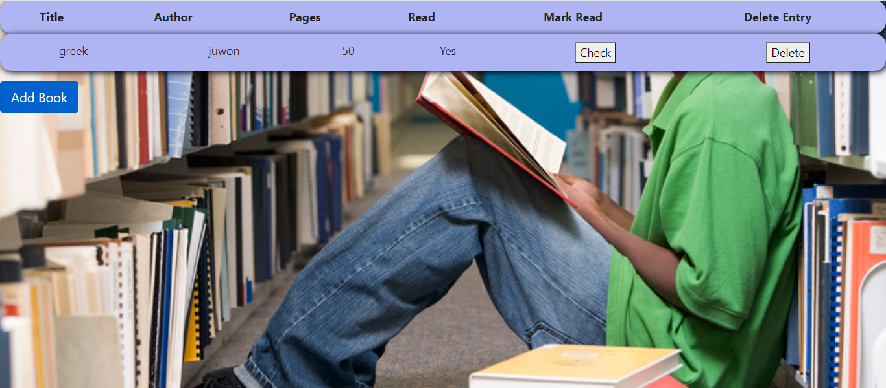

## Getting Started

**To get this project set up on your local machine, follow these simple steps:**

**Step 1** 
Navigate through the local folder where you want to clone the repository and run 
` git clone https://github.com/billodiallo/myLibrary/tree/feature_library`. It will clone the repo to your local folder. 
or with https 
`https://github.com/billodiallo/myLibrary/tree/feature_library`. 
**Step 2** 
Open the folder and double click on `index.html`

> This Project entails building a mini e-library where we can store books with required parameterts of :Title,Author,Pages and Read.

A user can signify a book to be read by clicking the read button or delete it away.every book appears in it's own card with buttons to delete or add.

## Built With

- Javascript,
- HTML-CSS
- Bootstrap
- Local-storage

## Live Demo

[Live Demo Link]()

## Authors

👤 Billo Dallio

- GitHub: [@billodiallo](https://github.com/billodiallo)
- Twitter: [@BilloDi83547008](https://twitter.com/BilloDi83547008)
- LinkedIn: [Billo Diallo](https://www.linkedin.com/in/mabillodiallo/)

👤 **Author**

Oluwadare Juwon

- Github: [@Oluwadare Juwon](https://github.com/wintan1418)
- Linkedin: (www.linkedin.com/in/oluwintan)
- Twitter: [Oluwadare-juwon](https://twitter.com/@oluwadarejuwon)

## 🤝 Contributing

Contributions, issues and feature requests are welcome!

Feel free to check the [issues page](issues/).

## Show your support

Give a ⭐️ if you like this project!

## Acknowledgments

- Odin Project
- Microverse

## 📝 License

This project is [MIT](https://opensource.org/licenses/MIT) licensed.
